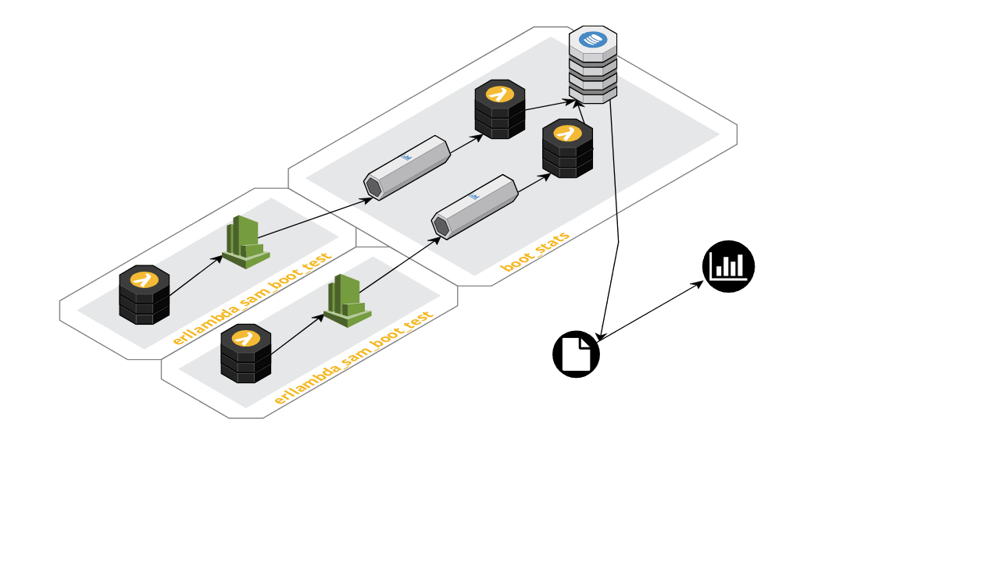

erllambda_sam_boot_test
=======================

Minimalist erllambda function to test boot/execution time.

## Overview

The `erllambda_sam_boot_test` is an [AWS Lambda](https://aws.amazon.com/lambda/)
function implemented using the [erllambda](https://github.com/alertlogic/erllambda)
application to implement the function using the Erlang language.

This AWS CloudFormation stack works together with
[boot_stats](https://github.com/velimir/boot_stats) stack.

## Usage

### Deploy [boot_stats](https://github.com/velimir/boot_stats) stack

See [boot_stats](https://github.com/velimir/boot_stats) for details

### Build package

Build lambda function as it's described in [rebar3 erllambda plugin](https://github.com/alertlogic/rebar3_erllambda).

### Run tests

Using `run-test.sh` script generate stats by performing deploy/invoke/destroy cycle. Example

    ./run-test.sh \
        erllambda-sam-boot-test \
        arn:aws:kinesis:us-east-1:748063234832:stream/boot-stats-LogStreamEmbedded-2RJLBOPQEUYH embedded \
        erllambda-artifacts \
        20
